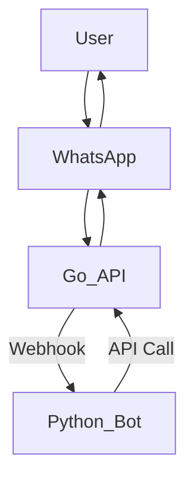

# HXNID-Bot-WA

This project consists of two main services: a Go-based WhatsApp API and a Python-based WhatsApp bot, orchestrated using Docker Compose.

## Project Overview

HXNID-Bot-WA is a robust WhatsApp bot solution designed to automate interactions and provide various functionalities through WhatsApp. It leverages a Go-based API for direct WhatsApp communication and a Python-based bot for business logic and intelligent responses. The Go API acts as the bridge to WhatsApp, handling message sending and receiving, while the Python bot processes these messages, executes commands, and integrates with other services.

### Architecture Diagram



**Explanation of Diagram:**
*   `User` interacts with `WhatsApp`.
*   `WhatsApp` sends messages to the `Go_API`.
*   `Go_API` forwards incoming messages to the `Python_Bot` via a webhook.
*   `Python_Bot` processes the message and, if needed, sends a response back to the `Go_API` via an API call.
*   `Go_API` then sends the response to `WhatsApp`, which delivers it to the `User`.

## Features

### Go WhatsApp API Features
*   Handles direct WhatsApp communication (sending/receiving text messages, media files like images, videos, and documents).
*   Manages WhatsApp session and authentication.
*   Provides webhook capabilities for real-time message forwarding to the Python bot.
*   Supports multi-device functionality.

### Python WhatsApp Bot Features
*   Processes incoming WhatsApp messages from the Go API.
*   Responds to specific commands (e.g., 'hello', 'status', 'help').
*   Can be extended to integrate with external services or databases for dynamic responses.
*   Provides a flexible framework for implementing custom bot logic.

## Prerequisites

Before running this project, ensure you have the following installed:

*   **Docker**: [https://docs.docker.com/get-docker/](https://docs.docker.com/get-docker/)
*   **Docker Compose**: [https://docs.docker.com/compose/install/](https://docs.docker.com/compose/install/)

## Setup

1.  **Environment Variables**:
    Create a `.env` file in the root directory of the project by copying the `.env.example` file.

    ```bash
    cp .env.example .env
    ```

    Edit the `.env` file and configure the necessary environment variables for both the Go API and the Python bot. Below are the common environment variables you might need to set:

    #### Go API Configuration
    These variables are primarily configured via command-line arguments in `docker-compose.yml` but are listed here for clarity on their purpose:
    *   `BASIC_AUTH_USERNAME`: Username for basic authentication (e.g., `admin`).
    *   `BASIC_AUTH_PASSWORD`: Password for basic authentication (e.g., `admin`).
    *   `GO_API_PORT`: Port for the Go API (e.g., `3000`).
    *   `DEBUG_MODE`: Enable debug logging (e.g., `true`).
    *   `OS_TYPE`: Operating system type for WhatsApp Web (e.g., `Chrome`).
    *   `ACCOUNT_VALIDATION`: Enable/disable account validation (e.g., `false`).
    *   `WEBHOOK_URL`: Webhook URL for the Python bot (e.g., `http://whatsapp_python:5050/webhook`).

    #### Python Bot Configuration
    These variables are read from the `.env` file by the Python bot:
    *   `GO_WA_API_URL`: URL of the Go WhatsApp API (e.g., `http://whatsapp_go:3000`).
    *   `GO_WA_API_USERNAME`: Username for Go API authentication (e.g., `user1`).
    *   `GO_WA_API_PASSWORD`: Password for Go API authentication (e.g., `pass1`).
    *   `PYTHON_WEBHOOK_URL`: Webhook URL for the Python bot (e.g., `http://whatsapp_python:5000/webhook`).
    *   `PYTHON_WEBHOOK_SECRET`: Secret key for webhook authentication (e.g., `my-python-webhook-secret`).
    *   `ALLOW_SELF_MESSAGE`: Boolean to allow bot to respond to its own messages (e.g., `True`).
    *   `FLASK_APP`: Main Flask application file (e.g., `main.py`).
    *   `FLASK_RUN_PORT`: Port for the Flask application (e.g., `5555`).
    *   `TIMEZONE`: Timezone setting for the bot (e.g., `Asia/Jakarta`).

## Running the Application with Docker Compose

To build and run both services using Docker Compose, navigate to the root directory of the project (where `docker-compose.yml` is located) and execute the following command:

```bash
docker-compose up --build -d
```

*   `up`: Starts the services defined in `docker-compose.yml`.
*   `--build`: Builds the Docker images for the services before starting them. This is important for the first run or after any changes to the Dockerfiles or application code.
*   `-d`: Runs the containers in detached mode (in the background).

This command will:
1.  Build the Docker image for the `whatsapp_go` service.
2.  Build the Docker image for the `whatsapp_python` service.
3.  Start both services, making them accessible on their respective ports (3000 for Go API, 5000 for Python bot) as defined in `docker-compose.yml`.

## Stopping the Application

To stop and remove the running containers, networks, and volumes created by `docker-compose up`, run the following command from the project root directory:

```bash
docker-compose down
```

## Accessing Services

*   **Go WhatsApp API**: Accessible at `http://localhost:3001` (Mapped from container port 3000)
*   **Python WhatsApp Bot**: Accessible at `http://localhost:5555` (Mapped from container port 5000, this service depends on the Go API)

### Interacting with the Python Bot
Once the services are running, you can interact with the Python bot by sending messages to the WhatsApp number linked to the Go API.
*   **Example:** Send 'hello' to the bot to receive a greeting message.
*   **Example:** Send 'help' to see a list of available commands.

### Testing the Go WhatsApp API
You can test the Go WhatsApp API directly using `curl` or a tool like Postman/Insomnia. Replace `admin:admin` with your configured basic auth credentials and `YOUR_JID` with the recipient's WhatsApp JID (e.g., `6281234567890@s.whatsapp.net`).

**Example: Check API status:**
```bash
curl -u admin:admin http://localhost:3001/api/status
```

**Example: Send a message:**
```bash
curl -u admin:admin -X POST http://localhost:3001/api/send/message -H "Content-Type: application/json" -d '{
    "jid": "YOUR_JID",
    "message": "Hello from the Go API!"
}'
```

## Troubleshooting and FAQ

*   **"Port already in use" error:**
    This usually means another application is using port `3001` (Go API) or `5555` (Python Bot). You can either stop the conflicting application or change the port mappings in `docker-compose.yml`.
*   **"Docker Compose not found" error:**
    Ensure Docker Compose is correctly installed and added to your system's PATH. Refer to the Docker Compose installation guide in the Prerequisites section.
*   **"Bot not responding" or "Messages not being processed":**
    *   **Check Docker logs:** Use `docker-compose logs whatsapp_go` and `docker-compose logs whatsapp_python` to check for errors in the Go API and Python bot containers.
    *   **Verify `.env` configuration:** Ensure all environment variables in your `.env` file are correctly set, especially `GO_WA_API_URL` and `PYTHON_WEBHOOK_URL`.
    *   **Network connectivity:** Confirm that the `whatsapp_go` and `whatsapp_python` services can communicate within the Docker network. The `depends_on` in `docker-compose.yml` helps, but network issues can still occur.
    *   **Go API session:** Ensure the Go API has successfully connected to WhatsApp and is authenticated. Check its logs for QR code generation or session restoration messages.
*   **"Basic authentication failed" error:**
    Verify the `BASIC_AUTH_USERNAME` and `BASIC_AUTH_PASSWORD` in your Go API configuration (either in `docker-compose.yml` or if you're running it directly, in its environment variables) match what you're using to access the API.
